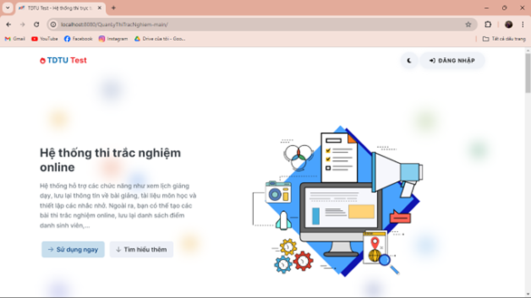
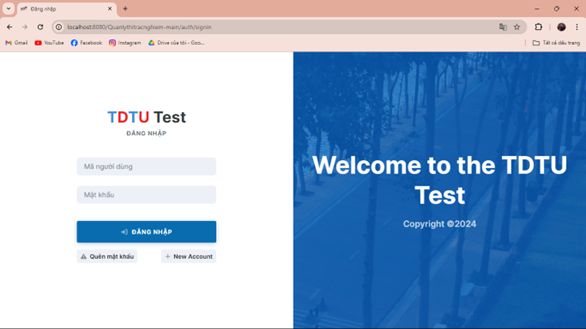
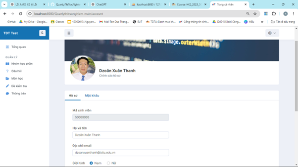
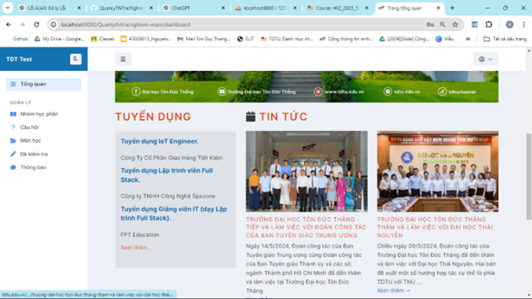
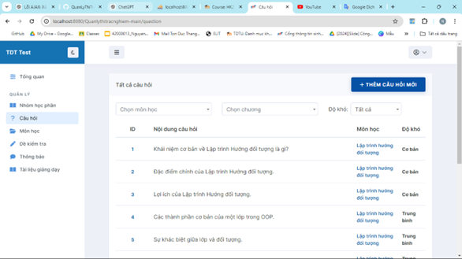
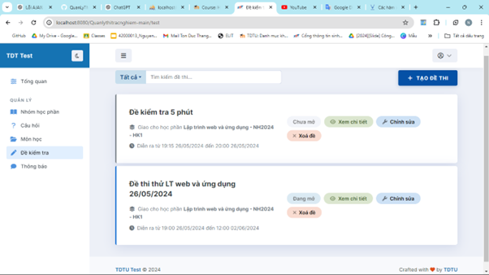
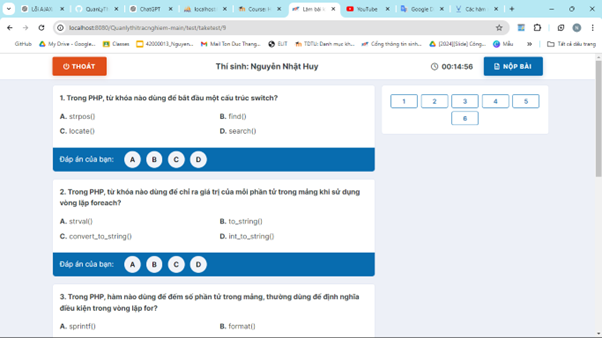
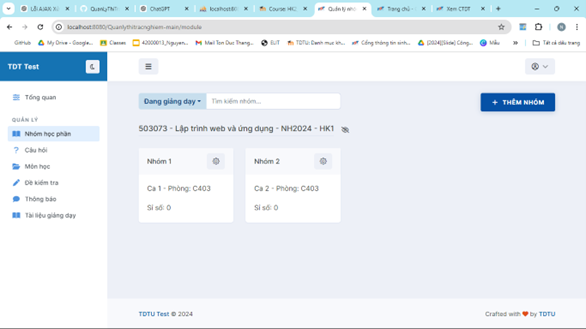
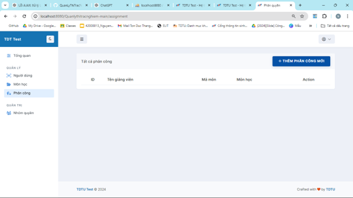
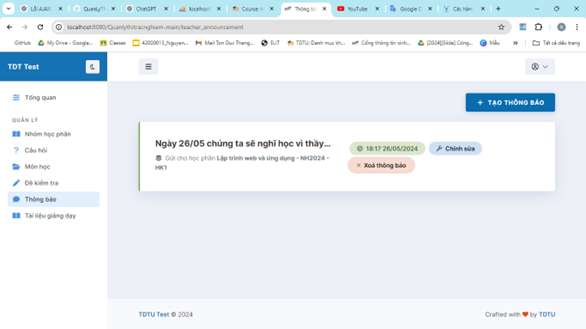

# Lập trình web và ứng dụng
### Các thành viên:
- Nguyễn Quốc Huy 52200084
- Lâm Huỳnh Như 52200028
- Nguyễn Nhật Huy 52200080

### Tài khoản:
- Admin
Username: 52200028
Password: 123456

- Giáo viên
Username: 550000000
Password: 123456

- Sinh viên
Username: 50000000
Password: 123456

### Các chức năng được phát triển
1.	Màn hình chính
Cho phép tất cả người dùng xem được thông tin chức năng của trang web.
2.	Đăng nhập
Cho phép tất cả người dùng đăng nhập vào hệ thống để sử dụng dịch vụ. Tài khoản được cung cấp sẳn bởi giảng viên.
3.	Quản lí môn học
Cho phép người dùng quản lí các môn học trong khoa, thêm xóa môn học.
4.	Phân công giản viên cho môn học
Mỗi môn học cần có giảng viên giảng dạy, nên cần có chức năng phân công cho giảng viên giảng dạy môn học.
5.	Quản lí nhóm học phần
Cho phép người dùng quản lí các nhóm học của từng môn học, thêm các sinh viên.
6.	Thêm thông báo cho các nhóm học phần
Cho phép người dùng tạo mới thông báo đến các môn học của mình, các sinh viên có trong nhóm học phần sẽ nhận được thông báo ở hộp thoại thông báo.
7.	Lưu trữ và thêm tài liệu giảng dạy cho môn học
Cho phép người dùng lưu trữ và tải tài liệu cho các môn học mà mình giảng dạy.
8.	Thêm các câu hỏi cho các môn học
Cho phép người dùng tạo các câu hỏi cho từng chương của môn học, để khi

### Giao diện

<h4 align="center">Giao diện khởi động</h4>

<h4 align="center">Đăng nhập</h4>

<h4 align="center">Hồ sơ cá nhân</h4>

<h4 align="center">Tổng quan</h4>

<h4 align="center">Câu hỏi</h4>

<h4 align="center">Đề kiểm tra</h4>

<h4 align="center">Tham gia thi</h4>

<h4 align="center">Nhóm học phần</h4>

<h4 align="center">Phân công</h4>

<h4 align="center">Người dùng</h4>

<h4 align="center">Thông báo</h4>

